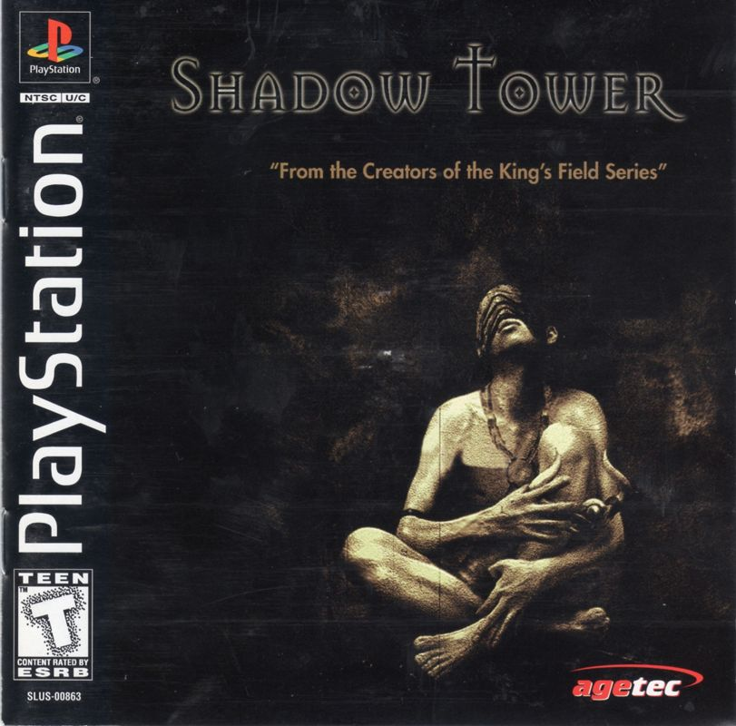

# ReShadowTower



An experimental Shadow Tower recompilation for Linux and Windows x64.
Mouse look, WASD, upscaled rendering, and sharper texture filtering.

[gameplay demo](https://www.reddit.com/r/shadowtower/comments/1wkzy54/shadow_tower_native_psx_recomp_demo/).

Requires your own **Shadow Tower (USA), SLUS-00863** BIN/CUE dump.
No retail BIOS needed. OpenBIOS is included in the build.


## Setup

### Supply the disc and build

The [`disc/`](disc/README.md) directory is included. Put your dump here:

```text
disc/Shadow Tower (USA).bin
disc/Shadow Tower (USA).cue

```
### Linux

Install Git, Python 3.11+, CMake 3.20+, Ninja, pkg-config, GCC/G++ with C++20
support, and OpenGL development libraries. GCC is required by the overlay
compiler even if you use Clang for the runtime. SDL3 3.4+ is used if installed;
otherwise the build downloads it. Building SDL3 needs your distro's
window-system and audio development packages.

On Arch Linux, install the dependencies with:

```bash
sudo pacman -Syu --needed base-devel git python cmake ninja pkgconf sdl3 libglvnd
```

This uses packaged SDL3. Install the appropriate GPU driver separately.

### Windows

Install [MSYS2](https://www.msys2.org/), which supplies `pacman` and the build
tools on Windows. This builds a native Windows `.exe`; **WSL is not required**.
`pacman` is run inside MSYS2, not ordinary PowerShell or Command Prompt.

The instructions below are for a native Windows build. The tested route so far
is cross-compilation on Linux followed by Wine testing, not an end-to-end MSYS2
build on real Windows.

Open **MSYS2 MINGW64** from the Start menu, then update:

```bash
pacman -Syu
```

If prompted to close the shell, reopen MINGW64 and run that command again.
Install the build tools:

```bash
pacman -S --needed git mingw-w64-x86_64-gcc mingw-w64-x86_64-cmake \
  mingw-w64-x86_64-ninja mingw-w64-x86_64-python mingw-w64-x86_64-pkgconf
```

Run the commands below in MINGW64, not PowerShell or the plain MSYS shell.
Both platforms need working OpenGL 3.3 drivers and internet access for the first build.

## Build and run

```bash
git clone --recurse-submodules https://github.com/JFryy/reshadowtower.git
cd reshadowtower
```

### Framework submodule

`psxrecomp/` is a Git submodule containing the PSXRecomp compiler and runtime.
The clone command fetches it and its nested dependencies at the revisions pinned
by this repository. If you already cloned without `--recurse-submodules`, run
this from the repository root before building:

```bash
git submodule update --init --recursive
```


The CUE's `FILE` entry must match the BIN filename. Other regions are not supported.
The build extracts the executable automatically.

```bash
./scripts/build.sh
./scripts/run.sh
```

The first build takes a while. Afterward, use `./scripts/run.sh` to play.
Keep the disc files in place. The executable is in `build-release/`, with an
`.exe` extension on Windows. Don't reuse a Linux build directory on Windows.

### Ahead-of-time compilation

The build generates C from your disc's boot executable and secondary game
executables, plus OpenBIOS, then compiles and links those modules into the
platform's runtime. The secondary modules are generated by
`tools/generate_aot.py`; CMake requires them rather than building only the boot
loader. This is ahead-of-time (AOT) compilation.

The runtime still has interpreter fallback for code that cannot use a compiled
entry. Generating AOT modules does not prove every gameplay path runs natively;
a whole-game native-execution percentage has not been established.

## Controls

| Action | Input |
| --- | --- |
| Move | W / S |
| Strafe | A / D |
| Look | Mouse |
| Attack | Left click or F |
| Shield | Hold right click or Z |
| Interact / confirm | E or X |
| Inventory / back | C |
| Main menu / equipment | Tab |
| Menu navigation | WASD or arrows |
| Pause | Enter |
| Release mouse / cancel | Escape |
| Fullscreen | Alt+Enter |
| Save states | F7 |

Click during gameplay to capture the mouse. The first click won't attack.
Escape releases it but does not pause. Use E or X to confirm menus, not Enter.
Equip a shield before using it. Close the window to quit.

Controllers use the original digital-pad controls. The right stick is not mouse look.

Set mouse sensitivity at launch (default `1.0`, range `0.05`–`10`):

```bash
SHADOWTOWER_MOUSE_SENSITIVITY=0.75 ./scripts/run.sh
```

## Graphics

Defaults: OpenGL, 3× resolution, selective world-texture filtering, geometry
correction. No CRT effects or frame blending. Gameplay keeps its original roughly
20 updates per second.

Edit `[video]` in `game.toml`, then restart:

- `supersampling`: `1`–`4`. Lower it to reduce GPU load.
- `window_width`: initial window width, default `1280`.
- `texture_filtering = "nearest"`: disable the selective filter.

The custom filter is OpenGL-only. `build-release/settings.toml`, if present,
can override these settings. See [graphics notes](docs/graphics.md) for filtering
behavior and the limits of seam correction.

## Saves

Save at the game's headstones. Memory cards live in `saves/card1.mcd` and
`saves/card2.mcd`.

For save states: **F7**, choose a slot, **S** to save, **L** to load.
States live under `saves/openbios/` and may break between builds.
Keep normal game saves too.

Back up `saves/` with the game closed. Don't run two copies against the same saves.

## Update

Close the game and back up your saves first.

```bash
git pull --ff-only
git submodule update --init --recursive
./scripts/build.sh
```

Build errors: check the first error for missing development packages. Disc errors:
check the filenames, CUE entry, and USA release. When reporting a problem, include
your OS, GPU, and the output of `git rev-parse --short HEAD`.

## Contributions

Contributions are welcome, especially real Windows/MSYS2 testing, verified
setup instructions for other Linux distributions, and gameplay fixes.

- **Bug reports:** include your OS, GPU/driver, source revision
  (`git rev-parse --short HEAD`), reproduction steps, and relevant error output.
  Say whether Windows results came from real Windows or Wine.
- **Pull requests:** keep changes focused, explain what changed, and run the
  [development checks](#development-checks). Describe any manual gameplay tests
  and remaining validation gaps. Use disposable saves for testing.
- **Framework changes:** keep PSXRecomp fixes separate from title-specific code.
  Submit shared fixes upstream and explicitly document any submodule revision
  update; do not leave required changes only in an uncommitted submodule checkout.
- **Game data:** never submit disc dumps, extracted executables, generated game
  code, BIOS dumps, memory cards, or save states. Share reproduction steps rather
  than uploading those files.

## Development checks

The tests need no game disc, BIOS image, or generated game code. Install CMake,
a C compiler, SDL3, and PyOpenGL, then run:

```bash
python3 tools/run_tests.py
```

For a headless test run:

```bash
SDL_VIDEODRIVER=x11 LIBGL_ALWAYS_SOFTWARE=1 xvfb-run -a python3 tools/run_tests.py
```

Player builds disable debugging tools. To opt in after a normal build:

```bash
cmake -S . -B build-release -DPSX_DEBUG_TOOLS=ON
cmake --build build-release --target psx-runtime -j4
```

Running `./scripts/build.sh` again restores the player default (`OFF`).

## License and credits
This unofficial FromSoftware fan project uses:

- [PSXRecomp](https://github.com/mstan/psxrecomp), under its
  [PolyForm Noncommercial license](https://github.com/mstan/psxrecomp/blob/ed55299be34710a90fc080484a83e8634bd41fa9/LICENSE).
  Its noncommercial restrictions still apply to the framework and combined runtime.
- [OpenBIOS](https://github.com/mstan/psxrecomp/blob/ed55299be34710a90fc080484a83e8634bd41fa9/bios/OpenBIOS.LICENSE),
  under MIT and its accompanying third-party notices.

