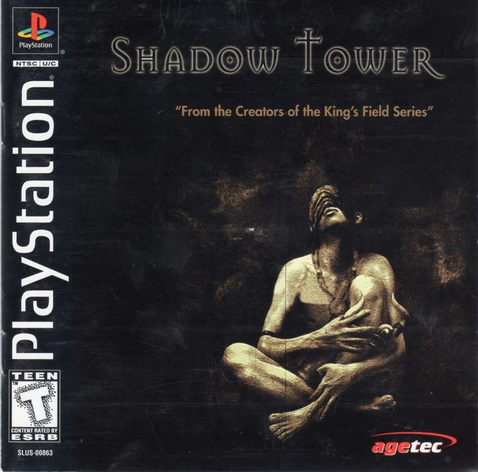

# ReShadowTower



An experimental Shadow Tower recompilation for Linux and Windows x64.
Mouse look, WASD, upscaled rendering, and sharper texture filtering.

[gameplay demo](https://www.reddit.com/r/shadowtower/comments/1wkzy54/shadow_tower_native_psx_recomp_demo/).

Requires your own **Shadow Tower (USA), SLUS-00863** BIN/CUE dump.
No retail BIOS needed. OpenBIOS is included in the build.


## Install

Download the Linux AppImage or Windows installer from the
[releases page](https://github.com/JFryy/reshadowtower/releases).

- **Linux:** make the `.AppImage` executable (`chmod +x ReShadowTower-*.AppImage`), then launch it.
- **Windows:** run the `*-setup.exe` installer, then open ReShadowTower from the Start menu.

On first launch, select your USA disc dump. Setup generates and compiles the game
locally using bundled tools, with no downloads or MSYS2 required. Keep the disc
files available. Both platforms require working OpenGL 3.3 drivers.

## Build from source

Requires Git, Python 3.11+, CMake 3.20+, Ninja, pkg-config, GCC/G++ with C++20,
and OpenGL development libraries. Install SDL3 3.4+ or let the build download it
(with your system's window/audio development packages installed).

On Arch Linux:

```bash
sudo pacman -Syu --needed base-devel git python cmake ninja pkgconf sdl3 libglvnd
```

For Windows source builds, use [MSYS2 MINGW64](https://www.msys2.org/) with the
corresponding `mingw-w64-x86_64-*` packages. Native MSYS2 builds remain unverified.

```bash
git clone https://github.com/JFryy/reshadowtower.git
cd reshadowtower
```

Place your dump in `disc/` as `Shadow Tower (USA).bin` and
`Shadow Tower (USA).cue`; the CUE's `FILE` entry must match the BIN filename.

```bash
./scripts/build.sh
./scripts/run.sh
```

The first build needs internet access. CMake fetches checksum-verified framework
sources into `build-dependencies/`; no Git submodules are needed. To use a complete
local framework source tree instead, set `PSXRECOMP_ROOT=/path/to/psxrecomp`.
Later launches use `./scripts/run.sh`. Output is in `build-release/`; do not share
that directory between Linux and Windows.

Builds compile generated game code and OpenBIOS ahead of time, with interpreter
fallback for unsupported paths. Not every gameplay path is verified as native.

To build distributable packages without game data, run the **Offline release
packages** workflow on your branch. It builds both platforms with pinned tools.

## Controls

| Action | Input |
| --- | --- |
| Move | W / S |
| Strafe | A / D |
| Look | Mouse |
| Attack | Left click or F |
| Shield | Hold right click or Z |
| Interact / confirm | E or X |
| Inventory / back | C |
| Main menu / equipment | Tab |
| Menu navigation | WASD or arrows |
| Pause | Enter |
| Release mouse / cancel | Escape |
| Fullscreen | Alt+Enter |
| Save states | F7 |

Click during gameplay to capture the mouse. The first click won't attack.
Escape releases it but does not pause. Use E or X to confirm menus, not Enter.
Equip a shield before using it. Close the window to quit.

Controllers use the original digital-pad controls. The right stick is not mouse look.

Set mouse sensitivity at launch (default `1.0`, range `0.05`–`10`):

```bash
SHADOWTOWER_MOUSE_SENSITIVITY=0.75 ./scripts/run.sh
```

## Saves

Save at the game's headstones. Memory cards are `card1.mcd` and `card2.mcd` in:

- **Linux package:** `$XDG_DATA_HOME/reshadowtower/saves` (default `~/.local/share/reshadowtower/saves`).
- **Windows package:** `%LOCALAPPDATA%\ReShadowTower\saves`.
- **Source build:** `saves/` in the repository.

For save states: **F7**, choose a slot, **S** to save, **L** to load.
States may break between builds.
Keep normal game saves too.

Back up your saves directory with the game closed. Don't run two copies against the same saves.

## Update

Close the game and back up your saves first. For packaged builds, install the
new Windows version or launch the new AppImage; packaged releases share saves.
For source builds:

```bash
git pull --ff-only
./scripts/build.sh
```

Build errors: check the first error for missing development packages. Disc errors:
check the filenames, CUE entry, and USA release. When reporting a problem, include
your OS, GPU, and the output of `git rev-parse --short HEAD`.

## Contributions

Contributions are welcome, especially real Windows/MSYS2 testing, verified
setup instructions for other Linux distributions, and gameplay fixes.

- **Bug reports:** include your OS, GPU/driver, source revision
  (`git rev-parse --short HEAD`), reproduction steps, and relevant error output.
  Say whether Windows results came from real Windows or Wine.
- **Pull requests:** keep changes focused, explain what changed, and run the
  [development checks](#development-checks). Describe any manual gameplay tests
  and remaining validation gaps. Use disposable saves for testing.
- **Framework changes:** keep PSXRecomp fixes separate from title-specific code.
  Submit shared fixes upstream and update the verified pins in
  `cmake/dependencies.json`; do not rely on changes only in a local source override.
- **Game data:** never submit disc dumps, extracted executables, generated game
  code, BIOS dumps, memory cards, or save states. Share reproduction steps rather
  than uploading those files.

## Development checks

The tests need no game disc, BIOS image, or generated game code. Install CMake,
Ninja, a C compiler, SDL3, and PyOpenGL, then run (the first run fetches the pinned
framework sources):

```bash
python3 tools/run_tests.py
```

For a headless test run:

```bash
SDL_VIDEODRIVER=x11 LIBGL_ALWAYS_SOFTWARE=1 xvfb-run -a python3 tools/run_tests.py
```

Player builds disable debugging tools. To opt in after a normal build:

```bash
cmake -S . -B build-release -DPSX_DEBUG_TOOLS=ON
cmake --build build-release --target psx-runtime -j4
```

Running `./scripts/build.sh` again restores the player default (`OFF`).

## License and credits
This unofficial FromSoftware fan project uses:

- [PSXRecomp](https://github.com/mstan/psxrecomp), under its
  [PolyForm Noncommercial license](https://github.com/mstan/psxrecomp/blob/ed55299be34710a90fc080484a83e8634bd41fa9/LICENSE).
  Its noncommercial restrictions still apply to the framework and combined runtime.
- [OpenBIOS](https://github.com/mstan/psxrecomp/blob/ed55299be34710a90fc080484a83e8634bd41fa9/bios/OpenBIOS.LICENSE),
  under MIT and its accompanying third-party notices.

